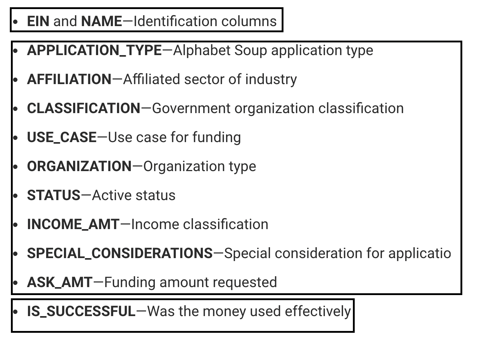
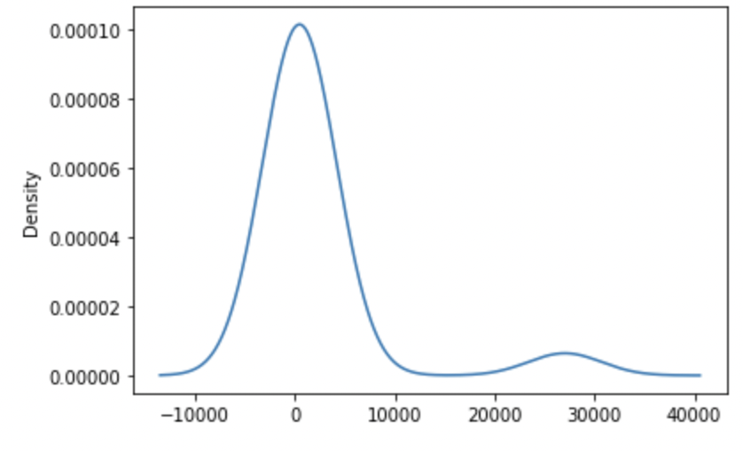
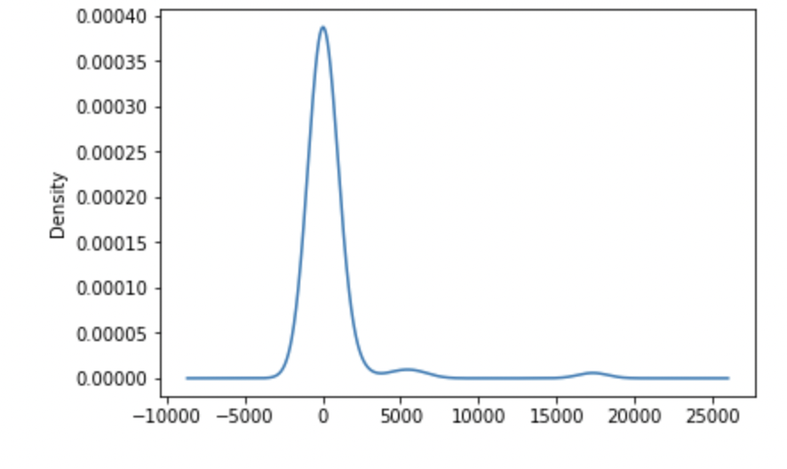
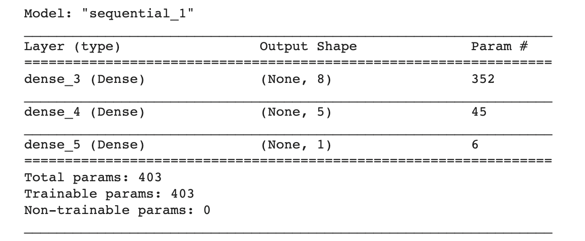
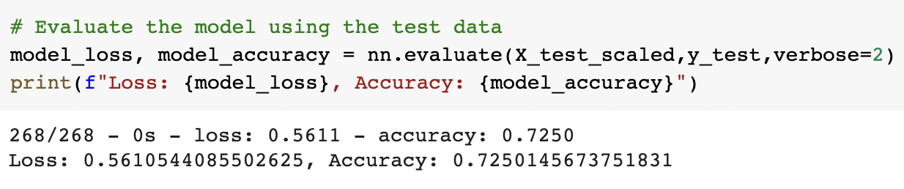

# Neural Network Charity Analysis

Using Python's TensorFlow library to implement a binary classification neural network to help a foundation vet potential donation recipients in order to ensure that the donations are impactful. 

# Overview of the analysis:

Explain the purpose of this analysis.

# Results: 

## Data Preprocessing

- The image above displays all of the columns present in the [dataset](charity_data.csv) that was used to train the deep learning neural network. The column <b>"Is_Successful"</b> (was the money used effectively?) is used as the <b>target</b> for the model, since that is the outcome we are aiming to predict as a way to vet potential donation recipients.  

- The remaining columns ("APPLICATION_TYPE", "AFFILIATION", "CLASSIFICATION", "USE_CASE", "ORGANIZATION", "STATUS", "INCOME_AMT", "SPECIAL_CONSIDERATIONS" and "ASK_AMT") can be considered as potential <b>features</b> (independent variables) for the model. The columns <b>"EIN" and "NAME"</b> were <b>removed</b> as potential features as they simply contain identification information and so cannot be very informative in predicting the target variable. 

- Two of the <b> categorical </b> columns ("APPLICATION_TYPE" and "CLASSIFICATION") contained more than 10 unique values and were further examined to determine whether any of those values occured infrequently enough to warrant binning. Below are the density plots of the unique value frequencies for the two categorical columns. 

| APPLICATION_TYPE | CLASSIFICATION |
:-------------------------:|:-------------------------:
 | 

- From the density plots I determined to bin any unique value that occurred less frequently than 500 times under "APPLICATION_TYPE" or 1800 times under "CLASSIFICATION". 

- The categorical data was then transformed to numerical data and all values were scaled before being fed to the model. 

## Compiling, Training, and Evaluating the Model

For the first iteration of the model, I started with one hidden layer in addition to the input and output layer, with the intention of adding more hidden layers as necessary depending on model performance. <b> NUMBER OF NEURONS USED AND WHY</b> 
A Relu activation function was used for the input and hidden layer, since its very possible that the given features have a nonlinear relationship with the target outcome. A Sigmoid activation function for the output layer as we are searching for a binary classification outcome. After training the model for 100 epochs, the loss was 0.561 adn the accuracy was 0.725, slightly under the goal of 75% accuracy. 

In order to increase model performance:

# Summary: 

Summarize the overall results of the deep learning model. Include a recommendation for how a different model could solve this classification problem, and explain your recommendation.

