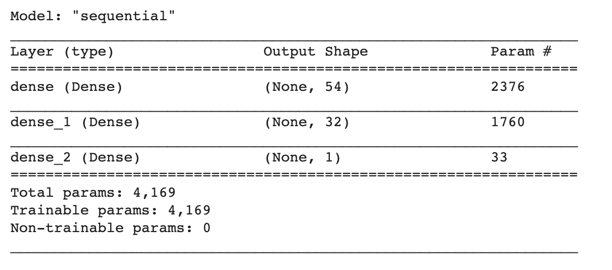
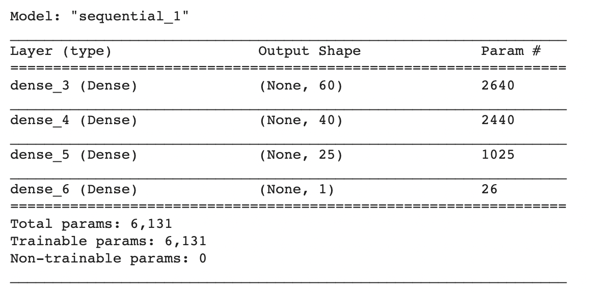
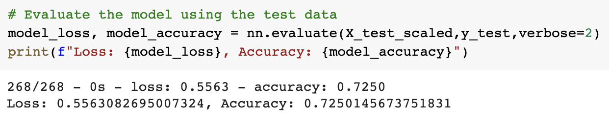
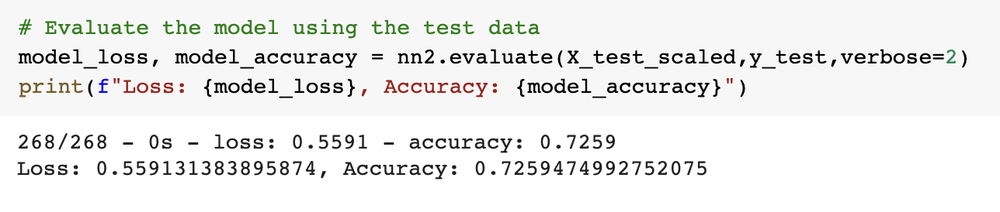
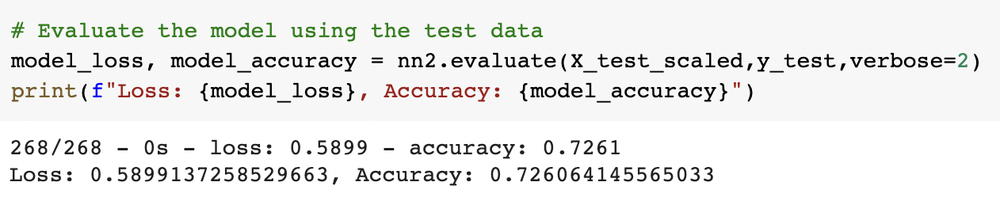

# Neural Network Charity Analysis

## Overview of the analysis:

Training a sequential deep neural network model from the Keras library with TensorFLow on a [charity dataset](charity_data.csv) to predict binary outcomes (with at least 75% accuracy) of whether or not charities used their donated money effectively. The successfully trained model can be used by foundations to help vet potential donation recipients in order to ensure that their donatons are going where they are most impactful. 

## Results: 

### Data Preprocessing

<b> Column names from the charity_data.csv dataset: </b>

- The image above displays all of the columns present in the [charity dataset](charity_data.csv) that was used to train the deep learning neural network. The column <b>"Is_Successful"</b> is used as the target for the model, since that is the outcome we are aiming to predict as a method of vetting potential donation recipients.  

- The remaining columns are to be considered as features for the model. The columns <b>"EIN"</b> and <b>"NAME"</b> were removed as potential features, as they simply contain identification information and should not have a causal relationship to the target variable. 

- Two of the categorical columns (<b>"APPLICATION_TYPE"</b> and <b>"CLASSIFICATION"</b>) contained more than 10 unique values and were further examined to determine whether any of those values occured infrequently enough to warrant binning. Below are the density plots of the unique value frequencies for the two categorical columns. 

| APPLICATION_TYPE | CLASSIFICATION |
:-------------------------:|:-------------------------:
 | 

- From the density plots, I determined to bin any unique value that occurred less frequently than 500 times under <b>"APPLICATION_TYPE"</b> or 1800 times under <b>"CLASSIFICATION".</b> 

- The categorical data was then transformed to numerical data, and all values were scaled before being fitted to the model. 

### Compiling, Training, and Evaluating the Model

For the first attempt at training the deep neural network model, I started with two hidden layers in addition to the input and output layer, with the intention of adding more hidden layers as necessary depending on model performance.

A Relu activation function was used for the two hidden layers, since its very possible that the given features have a nonlinear relationship with the target outcome. A Sigmoid activation function was used for the output layer as we are searching for a binary classification outcome. The model was trained for 100 epochs.

<b>Model Summary:</b>

In order to increase model performance, I added additional neurons to the hidden layers, increasing the first hidden layer up from 8 to 54 neurons, and the second hidden layer up from 5 to 32 neurons, for a total of 86 neurons. 

<b>Model Summary:</b>

Since model performance was still below 75% accuracy, I further increased the number of neurons from 86 to 125, representing three times the number of inputs. I also added an additional hidden layer to the model.

<b>Model Summary:</b>

As the model performance was still below 75% accuracy, I made a third and final attempt to increase the accuracy by increasing the number of training epochs from 100 to 300. 

## Summary: 

Over four total training attempts, the deep learning model's accuracy increased from 72.50% to 72.61%, but did not exceed the 75% accuracy threshold. One potential issue could be an over fixation on unimportant features. An alternative recommendation could be to rank feature importance using a random forest classification model, and drop some of the least important features before retraining either the deep learning model or the random forest model. While the deep learning model may be slightly more adept for identifying variability in the data, the random forest model is less prone to overfitting and less computationally expensive, and therefore may be preferable in this situation. 

| Training Attempt #1 | Training Attempt #2 | 
:-------------------------:|:-------------------------:
 | 

| Training Attempt #3 | Training Attempt #4 |
:-----------------:|:-----------------------:
 | 

Questions? Comments? [Let's Connect!](https://www.linkedin.com/in/natalie-vandyke-npv/) 
